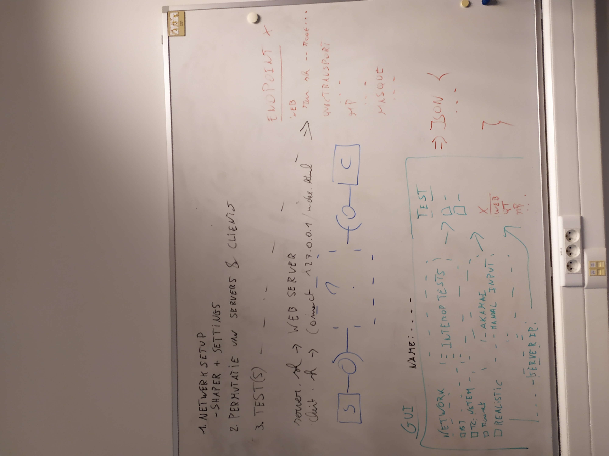
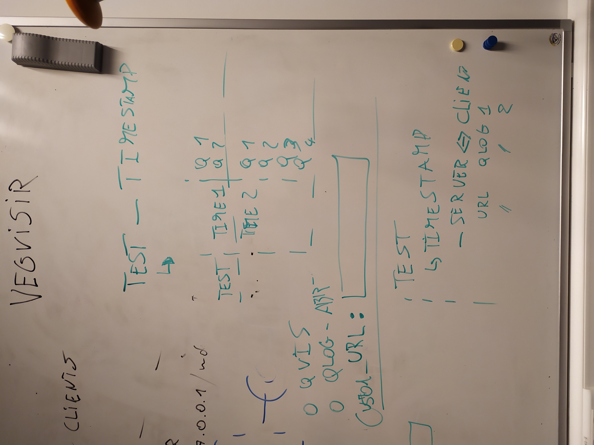

# vegvisir

- [Implementation Matrix](https://docs.google.com/spreadsheets/d/1w53XAfaft0BckMvXn0oTrg_6QA2nxHa_DKNJEtBHkXo): QUIC implementations and their supported features

## TODO

- [ ] Show iperf and own throughput test results, compare with shaper settings, show warning if error is greater than given percentage
- [ ] Network options:	
  - [x] ns-3
    - [x] interop tests
  - [x] tc-netem
    - [x] akamai
    - [x] manual (tc commands)
  - [ ] Mininet
  - [ ] realistic
    - [ ] server ip
- [ ] fully automate
- [x] chrome binaries to run client
  - directory with all clients
  - use AUR to find way to check for versions
- [ ] ns3 log if working?
- [ ] escalate root privileges correctly? 
- [x] use local domain name instead of IP address
- [x] version control for servers
- [x] wipe client cache
- [ ] dynamic frontend, hide entries from deselected sets
- [ ] no end time for client
- [x] testcase:
  - [x] timeout: start timeout thread, busy wait, join on thread
    - [x] on time, something that checks time until max
    - [x] on file existence, watcher for file
- [ ] export gui settings
- [x] result view tool
  - 
  - [x] filter on 'json/qlog', 'pcap', 'other'
  - [x] send multiple files to viewer
  - [x] download instead of open
- [ ] tests parameters
- [x] replace ns3 with tc-netem
- [ ] improve logging.debug prefixes

### Based upon

- [Network Simulator for QUIC benchmarking](https://github.com/marten-seemann/quic-network-simulator)
- [Interop Test Runner](https://github.com/marten-seemann/quic-interop-runner)
- [Speeder](https://speeder.edm.uhasselt.be/)

### Datasets

- [akamai cell emulation](https://github.com/akamai/cell-emulation-util/blob/master/cellular_emulation.sh)

### Commands

- update docker images: `docker images | grep -v ^REPO | sed 's/ \+/:/g' | cut -d: -f1,2 | xargs -L1 docker pull`
- google chrome: `google-chrome-unstable --origin-to-force-quic-on=193.167.100.100:443 --enable-experimental-web-platform-features --ignore-certificate-errors-spki-list=rVO69QdPatcs3YYnqxO7ccVD8iz1rOp0dSIAt7vNiGc= --log-net-log=/vegvisir/net-log.json https://193.167.100.100:443`